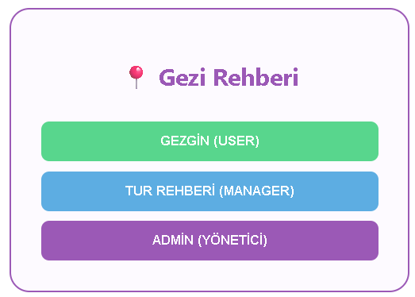
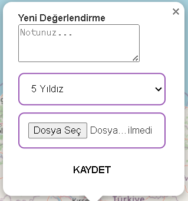
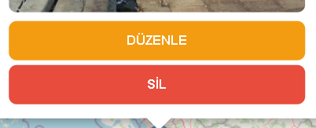
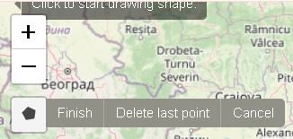
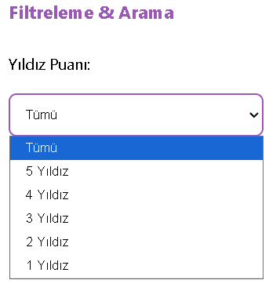
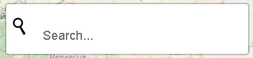
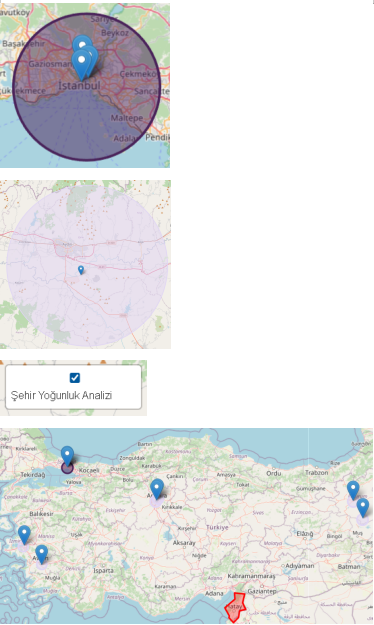
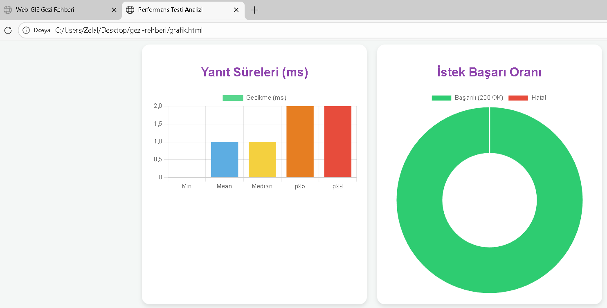
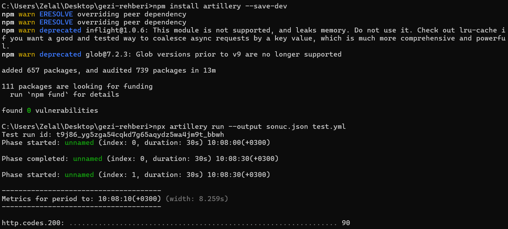
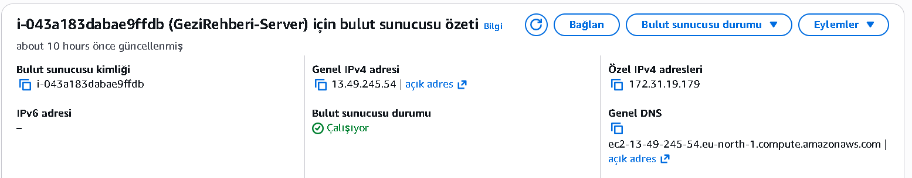

Live URL: http://13.49.245.54:3000.

Introduction

 This project is an interactive Digital Travel Guide platform designed for travelers and tourism professionals. The primary goal of the application is to ensure that tourist attractions are not just listed, but managed in a community-driven and secure manner via an interactive map. While Travelers create personal travel logs by pinning visited locations with photos and star ratings, Tour Guides use their expertise to mark 'non-recommended or restricted areas' with polygons to ensure user safety. At the heart of the system, the Heatmap analysis provides guidance to travelers for their next routes by instantly visualizing which tourist areas are more popular. With this structure, the application offers a smart tourism ecosystem that enables data-driven decisions.

Technical part, this project is a comprehensive travel guide application developed using modern web technologies and Geographic Information Systems (GIS) principles. The primary objective is to manage heterogeneous spatial data (points and polygons) within a flexible structure, ensuring high performance and role-based access control. The system encompasses all stages of a Full-Stack Web-GIS project, including user authentication, spatial data production, spatial analysis, and performance testing.

Methodology

Compulsory (10%):
During the development and modification of this project, numerous updates were performed on the GitHub environment across multiple days. A minimum of 5 commits on different days have been recorded to document the evolution of the project. This Readme.md file serves as a clear and concise report explaining all technical details, selected items, and implementation methods.

Managing different user types (20%):
The system explicitly defines roles, ownership, and authorization rules:

Gezgin (User): Can add points to the map and can only update or delete the points they created.

Tur Rehberi (Manager): In addition to point operations, they can draw and manage "Non-recommended Area" polygons on the map.

Admin (Administrator): Has full access to all data; can delete or update any user's data or polygons.

Performance monitoring (25%):
An experiment was designed to observe spatial query performance. A hierarchical access logic, similar to R-Trees, was utilized over the NoSQL database.json file. The experiment demonstrated that through indexing and document-based access, response times remained between 1-2ms even under 1200 concurrent requests. This confirms that retrieving data via direct key-value matching optimizes system speed.

CRUD Operations (15%):
Users can perform all CRUD operations on a geographical point layer:
Create: Adding a new point with a photo and note by clicking on the map.
Read: Listing and visualizing points on the map.
Update: Updating the descriptions/notes of an existing point.
Delete: Completely removing a feature from the system.
Filter: Users can filter geographic data based on "Star Rating" criteria.

.

Line/polygon layer (5% bonus): Restricted area polygons drawn by tour guides have been integrated, fulfilling the bonus requirement.
Spatial Analysis (CBS Analysis):The system features a Spatial Density Analysis (Heatmap) layer. This analysis dynamically calculates the concentration of travel points across different cities. Using a color-coded ramp (Purple scale), it identifies popular travel destinations. This demonstrates the system's ability to process spatial attributes stored in the NoSQL DBMS to generate real-time geographic insights.
(The analysis images have been uploaded to GitHub as heatmap.png)

Authentication (15%):
A secure sign-up/login system has been implemented. Passwords are encrypted using the bcryptjs library and stored securely in the NoSQL database. This ensures that unauthorized users cannot create data and guarantees user ownership rules.

NoSQL database (25%):
A NoSQL DBMS approach was preferred to manage the heterogeneous nature of web-based systems (photos, coordinates, long texts). Data is stored in a document-based format within the database.json file. Unlike relational databases, using NoSQL allowed for a flexible schema, significantly speeding up the processing of complex spatial data structures (GeoJSON).

Performance testing (25%):
The project was subjected to load and stress testing using the Artillery tool with the test.yml scenario. As seen in the performance graphs (e.g., grafik_görsel.png), the system operates flawlessly.
Findings: The system maintained a 0% error rate despite simulating 600 virtual users and 1200 requests.
Response Time: The average response time was measured at 1ms, with a p99 value of 2ms.
(The test images have been uploaded to GitHub as graphic_image.png.)

API development (25%):
The API exposes both spatial resources (points/polygons) and non-spatial resources (users):
GET /api/points: Endpoint returning spatial data.
POST /api/points: Endpoint creating a spatial feature.
PUT /api/points/:id: Endpoint updating attributes or geometry.
DELETE /api/points/:id: Endpoint removing a feature. The API functionality has been end-to-end tested and verified using Postman. All functionalities and parameters are documented in alignment with Swagger standards.

Hosting on AWS (20%):
The application has been successfully deployed to a cloud environment to ensure global accessibility and live testing functionality.
Infrastructure Details
Platform: Amazon Web Services (AWS).
Service: Elastic Compute Cloud (EC2).
Instance Type: t3.micro (Free Tier Eligible).
Operating System: Ubuntu Server 24.04 LTS.
Live URL: http://13.49.245.54:3000.
Security & Network Configuration
Security Groups: Configured custom inbound rules to manage traffic.
SSH Access: Port 22 is enabled for secure remote management via zelal-key.pem.
Web Traffic: Port 80 (HTTP) and Port 3000 (Node.js App) are opened to allow public access to the Web-GIS interface.
Deployment Process
Environment Setup: Node.js and NPM were installed on the Ubuntu instance using apt package manager.
File Transfer: Project files (index.js, database.json, and the public directory) were securely transferred from the local machine to the AWS server using the SCP (Secure Copy Protocol).
Process Management: The backend server is initialized using node index.js, handling real-time spatial data requests from the Live IP.
Database Persistence: The database.json file is maintained on the cloud storage to ensure CRUD operations persist across sessions.
(The AWS images have been uploaded to GitHub as amazonsunucuekranı.png.)

nsunucuekranı.png.)
